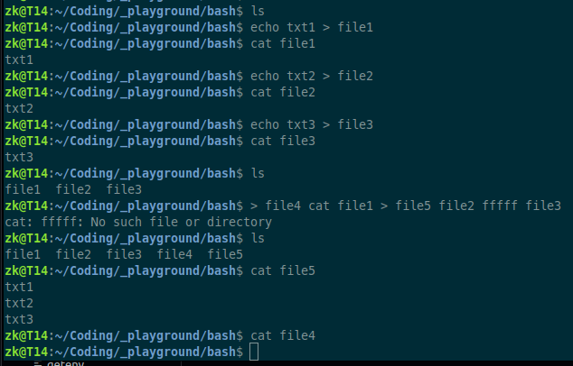
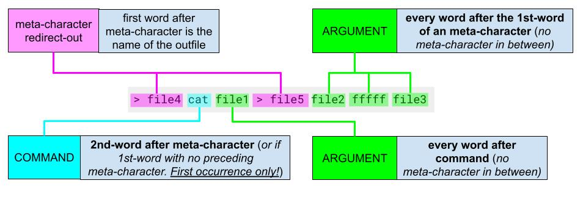
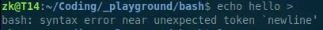
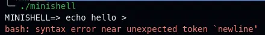
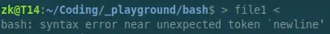
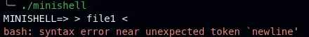
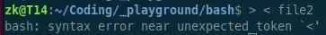
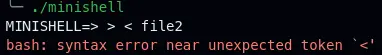
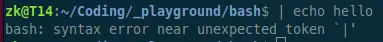
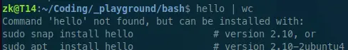

# Command Structure Rules
The document aims to explains by which rules the bash command is executed with it's arguments and directions.

## 1. Command and Argument rules
- **COMMAND**: the "1st-word" which is **not preceded** by a "**meta-character**" within each pipe.  
- **ARGUMENT**: any word **after** the "1st-word" which is preceded by a "**meta-character**", which is not already a command.
- **META CHARACTERS**: `<`, `<<`, `|`, `>`, `>>`, the first word after is associated with the character (*except* `|`). "White space" and those characters separate words from each other.  

## 2. Every command uses only one out-direction and one in-direction.
- **Out-direction** is: `>` direct-file-out, `>>` append-file-out or a `|` pipe.
- **In-direction** is: `<` direct-file-in, `<<` heredoc  
It is always the last **in-direction** or **out-direction** which is used!  
All **out-direction** files are created, if they not already exist.  
All **heredoc**s are executed (*user needs to type input*) but only the last one gets used.  
No information is passed to the **pipe** if there is an **out-direction** before it (*but pipe is executed*).

### Example:
  
There are 3 files with the following content: `file1` -> "`txt1`" , `file2` -> "`txt2`" , `file3` -> "`txt3`" .  
  
- `> file4` : **REDIRECT-OUT**
	- The file does not exist and is therefor created.
- `cat` : **COMMAND**
	- It does not matter if it is a "valid command", but it is structured as such, there can be only one, which is the first occurrence.  
- `file1` : **1st ARGUMENT**
- `> file5` : **REDIRECT-OUT**
	- The file does not exist and is also created, because it is the last redirection-out, it is the one which is going to be used, the other (`file4`) is not going to be used and remains empty.
- `file2` : **2nd ARGUMENT**
- `fffff` : **3rd ARGUMENT**
	- Is not a existing file nor a valid argument, but it is passed as augment to the command. When executing the command **later**, the cat command will throw an error, but still continue with the rest of the execution / command (`file3`).  
	`cat: fffff: No such file or directory`  
- `file3` : **4th ARGUMENT**

## 3. Variables
There are 3 types of variables:
|variable type|id|value|description|
|---|---|---|---|
|`$?` exit status variable|`VAR_EXIT`|`NULL`|The "word" is replaced with the exit status value from the structure `d.exit_status`.|
|`$`+ NAME variable|`VAR`|*same as name but without* `$`|-> 2nd character must be `_` or an alphabetic character from the english alphabet (*minimum requirement*)  -> numeric character can also be used after the 2nd character -> the name ends when this rules are broken.|
| `$` + invalid variable name|*no id*|*no value*|Names which not confirm with the above rules are removed from the string.  -> **REMOVED**: `$2` (*2nd number*), `$!` (*2nd nonalbhabetic or* `_` *or* `?`*. NOTE: the "bash shell" does interpret those as "special variables" but the subject requires only "meta characters" to be "interpreted".* )  -> **REMAIN AS CHARACTERS**: If `$` is on the **end of a word**. This is the case if "white space", a "meta character", "closed double or single quotes" follow.|

## Bash Syntax Errors
The shell throws an error and prompts the user for a new input. All mallocs are freed but the "variable table" remains. No commands are executed!
### Missing Word after "Meta Character" (*see `|` below*)
- **There must be always a word after a "meta character" !**  
If there is none or an invalid command, then the error occurs later when the command is executed.  
1. Non of the commands are executed, even if they come before the error.  

  
(*`echo` does not print "hello" to the screen, even error comes after*)
2. The error message is related to the position after the "meta character" with the missing word.  
   
(*related to the last meta character `<`, where a new line follows*)  
   
(*related to meta character `>`, where `<` follows*)

### Missing Word around `|`
1. Word is missing before **before** `|`, ...  
  
It is actually a command which is needed before `|` but the invalid command error is coming later when the pipe is executed not when the syntax is checked.  
  
2. Word is missing **after** `|`, prompt is waiting for input of the missing word (*command*), ...  
  
...which if valid will execute the command.

---

something

