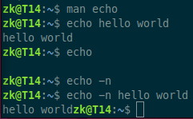
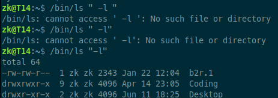

# Subject

- [back to README "MINISHELL"](../README.md)  
- [42 subject "MINISHELL" pdf](minishell.pdf)
---
*Create a simple version of the bash shell written in C.*

## Project Scope
Defines the features which the minishell can handle and are tested by the evaluators of the project.

### 1. Prompt
Prompt the user for input at the start and after a command has finished.

---
### 2. Builtins
Are contained within the shell itself. The shell executes the command directly, without invoking another program.
|command|option argument|description|
|---|---|---|
|`echo`|*only* `-n` *option, no argument*|Display it's argument as a line of text.<br>|
|`cd`|*no option*|Change (working) directory.<br>-> only change the "working directory", with absolute (*e.g.* `/bin`) or relative path (*e.g.* `../../`)<br>-> the output after trying to changing to a non existing directory (*"something"*)<br>`bash: cd: something: No such file or directory`|
|`pwd`|*no options or arguments*|Print working directory.|
|`env`|*no options or arguments*|Lists all environment variables.|
|`export`|*no options*|Exports environment variable, creates new one or replaces old one.<br>-> *e.g.* `export MY_VARIABLE="Hello World"`<br>(*create env variable "MY_VARIABLE" with the value "Hello World"*),<br>`export MY_VARIABLE="Hello Zolsk"`<br>(*changes the value of the env variable "MY_VARIABLE"*)|
|`unset`|*no options*|Remove environment variable.<br>-> *e.g.* `unset MY_VARIABLE`|
|`exit`|*no options*|Terminates a script or process (*minishell*).<br>-> ends the minishell, passing an integer determents the "exit code" of the terminated process<br>*e.g.* `exit 3` *after run* `echo $?` *expected outcome* `3`|

---
### 3. Simple Commands
Should be called through "absolute path" or "relative path" or "without path" (*based on the env `PATH` variable*). They can accept options and /or arguments (*see "man" page*).

#### 3.01 env path
Launch command base on the path of the environment variable, *e.g.* `ls`.

#### 3.02. absolute path
|absolute path|option|argument|outcome|
|---|---|---|---|
|`/bin/ls`|||*list directories in current location*|
|`/bin/ls`|`-l`||*use a long listing format*|
|`/usr/bin/mkdir`|`-v`|`dir_name`|*create directory with "dir_name" name and **v**erbose message*|
|`/usr/bin/rm`|`-r`|`dir_name`|removes the directory *"dir_name"*|  

#### 3.03. relative path
Use the same examples as above but change the path based on your current directory e.g. `../../bin/ls`.

---
### 4. Quotes
#### 4.01. single quotes
Single quotes **preserve the literal value** of variables and **disable** "[variable expansion](#variable-expansion)" and "[command substitution](#command-substitution)".

```bash
# no variable expansion
name="John"
echo 'My name is $name'
# output:
My name is $name

# no command substitution
echo '$(seq 1 3)'
# output:
$(seq 1 4)
```
- Options with **quotes and space** don't work only without space. The outcome is the same for **single** and **double** quotes.  


#### 4.02. double quotes
Double quotes **enable** "[variable expansion](#variable-expansion)" and "[command substitution](#command-substitution)".
```bash
# variable expansion
name="John"
echo "My name is $name"
# output:
My name is John
```
```bash
# command substitution
echo $(seq 1 3) # echo is called 3 times, each time with an value from 1 to 3
# output:
1 2 3
# command substitution
echo "$(seq 1 3)"
# output:
1
2
3
```
---
### 5. Environment Variables $
Env variables can be defined (`export`) changed or deleted (`unset`) and displayed (`env`).  
They should evaluate through `$` + `VARIABLE_NAME` to there values, *e.g.* `echo $HOME` *output:* `/home/zk`.

---
### 6. Process Exit Code $?
- After the last process ended **successfully** it should return `0`.  
*e.g.* `/bin/ls` `echo $?` *outcome:* `0`.
- After the last process ended **unsuccessfully** it should **NOT** return `0`.  
*e.g.* `/bin/ls fileThatDoesNotExist` `echo $?` *outcome:* `2`.

---
### 7. Redirection
- `<` redirect input.
- `>` redirect output.
- `<<` heredoc (doesn't affect history).
- `>>` redirect output in append mode.

---
### 8. Pipes
Commands can be piped `|` into there following commands.

---
### 9. Signals
The signals are a method of communication between processes. When a process receives a signal, the process interrupts its execution and a signal handler is executed.

|signal|[interactive mode](#interactive-mode)|[non interactive mode](#non-interactive-mode)|
|---|---|---|
|`CTRL C` **SIGINT**|??? displays a new prompt on a new line. (**not on my bash shell!!!**) ???|The default action is to terminate the process. However, some programs override this action and handle it differently. We can think of SIG**INT** as an **int**erruption request sent by the user. <br>??? stops the current processes from running in the foreground ???|
|`CTRL D` **SIGQUIT**|Ends the (*mini*) shell|Ends the process.|
|`CTRL \`|dose nothing|???|

---
### 10. History
Previous commands from the running shell can be accessed through the arrow keys.  
- `UP` -> previous command
- `DOWN` -> next command

---
### 11. Invalid Input
- Shut return an error message and not crash the program.  
*e.g.* `dddddd` *output:* `dddddd: command not found`
- Unclosed quotes or special characters like `\` or `;` are not interpreted.
- Interpreted characters are `$`, `$?`, `<`, `>`, `<<`, `>>`, `|`, `' '`, `" "`.

---
---
##### Footnotes
###### variable expansion
When a variable is evaluated before the shell is processing the command.

---
###### command substitution
>Command substitution allows the output of a command to replace the command itself. Bash performs the expansion by executing command and replacing the command substitution with the standard output of the command, with any trailing newlines deleted. Embedded newlines are not deleted, but they may be removed during word splitting. [bash reference manual](https://www.gnu.org/savannah-checkouts/gnu/bash/manual/bash.html#Command-Substitution)
```bash
# command substitution
echo $(seq 1 3) # echo is called 3 times, each time with an value from 1 to 3
# output:
1 2 3
```

---
###### interactive mode
When the shell waits for user input and displays the "prompt".

---
###### non interactive mode
When the "prompt" is not displayed and the shell is busy piping or reading from a file or another source. E.g. a blocking command like `cat` or `grep` without options or arguments which is waiting for user input (*heredoc*).
